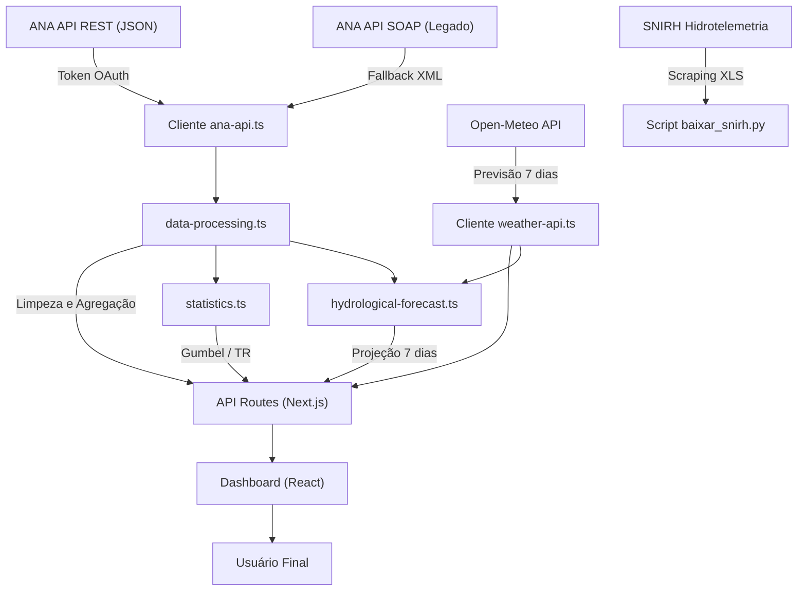

# Documentação Técnica — Hidro Alert: Nível Rio Negro

> **Sistema de Monitoramento Hidrológico e Alerta de Enchentes para Rio Negro (PR) e Mafra (SC)**

---

## 1. Visão Geral do Projeto

O **Hidro Alert** é uma aplicação web progressiva (PWA) desenvolvida em **Next.js 16 / React 19** para monitoramento em tempo real do nível do **Rio Negro** na região de Rio Negro (PR) e Mafra (SC), com base nos dados oficiais da **Agência Nacional de Águas e Saneamento Básico (ANA)**.

### 1.1 Objetivos

| Objetivo | Descrição |
|---|---|
| Monitoramento em tempo real | Leitura contínua da cota fluviométrica da Estação ANA 65100001 |
| Classificação de risco | Alertas visuais escalonados (Normal → Atenção → Alerta → Emergência) |
| Projeção hidrológica | Estimativa do comportamento do rio para os próximos 7 dias |
| Análise estatística de extremos | Distribuição de Gumbel e cálculo de Períodos de Retorno |
| Mapa de inundação | Manchas de inundação georreferenciadas por faixa de nível |
| Alertas preventivos | Notificações push para a população com base em limiares críticos |

### 1.2 Estação de Referência

| Atributo | Valor |
|---|---|
| **Código ANA** | `65100001` |
| **Nome** | Rio Negro |
| **Rio** | Rio Negro |
| **Coordenadas** | -26.1114°S, -49.8044°W |
| **Município** | Rio Negro – PR |
| **Tipo** | Fluviométrica (nível + vazão) |

> [!NOTE]
> A estação 65100001 é a referência oficial do SNIRH/ANA para a bacia do Rio Negro na divisa PR/SC. Dados complementares podem ser obtidos da estação convencional `65100000` para séries históricas mais longas.

---

## 2. Arquitetura e Fluxo de Dados



### 2.1 Pipeline de Dados

O sistema opera em **três camadas de aquisição de dados** com mecanismo de fallback automático:

1. **API REST da ANA** (prioritária): Autenticação via token OAuth, retorna JSON. Endpoint `HidroinfoanaSerieTelemetricaAdotada/v1`.
2. **API SOAP da ANA** (legado/fallback): Sem autenticação, retorna XML. Endpoints `ServiceANA.asmx`.
3. **SNIRH Hidrotelemetria** (complementar): Exportação via scraping web da série histórica em formato `.xls`.

> [!IMPORTANT]
> A API REST da ANA é limitada a 30 dias de dados por requisição. Para séries históricas longas (análise de Gumbel), o sistema automaticamente utiliza a API SOAP legada que suporta décadas de registros.

### 2.2 Normalização de Cotas

A cota (nível d'água) fornecida pela ANA pode vir em **centímetros** ou **metros** dependendo do endpoint e da época de registro. A função `normalizeLevelToMeters()` em [ana-api.ts](file:///Users/ramirobs/Documents/antigravity/Hidro/hidro-simulator/src/lib/ana-api.ts#L167-L183) padroniza todos os valores para **metros**:

- Valores > 30 são interpretados como centímetros e divididos por 100
- Valores sentinela (8888, 9999) são descartados como dados inválidos
- Valores > 15m (após conversão) são descartados como espúrios

---

## 3. Classificação de Risco

### 3.1 Limiares Operacionais

A classificação de risco segue os protocolos da **Defesa Civil** de Rio Negro (PR) e Mafra (SC), baseados nos marcos históricos de inundação locais:

| Nível do Rio | Classificação | Cor | Significado |
|---|---|---|---|
| < 5,00 m | 🟢 **Normal** | Verde | Nível dentro da faixa operacional. Sem risco. |
| ≥ 5,00 m | 🟡 **Atenção** | Amarelo | Nível elevado. Monitoramento ativo recomendado. |
| ≥ 6,00 m | 🟠 **Alerta** | Laranja | Risco de alagamento em áreas baixas e ribeirinhas. |
| ≥ 7,00 m | 🔴 **Emergência** | Vermelho | Enchente confirmada. Áreas ribeirinhas alagadas. |

Implementação em [statistics.ts](file:///Users/ramirobs/Documents/antigravity/Hidro/hidro-simulator/src/lib/statistics.ts#L47-L63) e [constants.ts](file:///Users/ramirobs/Documents/antigravity/Hidro/hidro-simulator/src/lib/constants.ts#L36-L41).

### 3.2 Marcos Críticos Georreferenciados (Régua de Inundação)

Os dados de [flood-map-data.ts](file:///Users/ramirobs/Documents/antigravity/Hidro/hidro-simulator/src/data/flood-map-data.ts) mapeiam pontos de infraestrutura e bairros com seus respectivos limiares de inundação:

| Ponto Crítico | Cidade | Cota de Inundação | Cota de Evacuação |
|---|---|---|---|
| Bairro Passa Três | Rio Negro (PR) | 6,50 m | 7,00 m |
| Rua São João / Volta Grande | Rio Negro (PR) | 6,80 m | 7,20 m |
| Vila Argentina | Mafra (SC) | 7,20 m | 7,50 m |
| Vila Ivete (Baixada) | Mafra (SC) | 7,60 m | 8,00 m |
| Bairro Buenos Aires | Mafra (SC) | 8,00 m | 8,50 m |
| Estação Nova | Rio Negro (PR) | 8,20 m | 8,80 m |
| Ponte Metálica | Intermunicipal | 8,50 m | — |
| Av. Frederico Heyse (Centro Mafra) | Mafra (SC) | 8,80 m | 9,20 m |
| Centro Histórico / Praça João Pessoa | Rio Negro (PR) | 10,20 m | 10,50 m |
| Ponte Cel. Severiano Maia | Intermunicipal | 10,50 m | — |
| Ponte Rodrigo Ajuz | Intermunicipal | 11,00 m | — |

### 3.3 Faixas da Mancha de Inundação (Polígonos Geoespaciais)

| Faixa | Nível | Severidade | Áreas Atingidas |
|---|---|---|---|
| Faixa 1 | 6,50 m – 7,50 m | Atenção | Várzeas, Passa Três, Rua São João, Baixada Vila Argentina |
| Faixa 2 | 7,50 m – 9,00 m | Alerta | Vila Argentina, Vila Ivete, acesso Ponte Metálica, Av. Frederico Heyse |
| Faixa 3 | 9,00 m – 11,00 m | Emergência | Centro de Mafra, Volta Grande, Buenos Aires, Estação Nova |
| Faixa 4 | > 11,00 m | Catastrófica | Praça João Pessoa, centros históricos, interdição total viária |

---

## 4. Análise Estatística de Extremos — Distribuição de Gumbel

### 4.1 Fundamentação Teórica

A análise de eventos extremos de cheia utiliza a **Distribuição de Gumbel (Tipo I para Máximos)**, também conhecida como *Generalized Extreme Value Type I (GEV-I)*. Essa distribuição é a mais amplamente utilizada na hidrologia brasileira para modelar máximas anuais de vazão e cota fluviométrica.

A função de distribuição acumulada (CDF) é:

$$F(x) = \exp\left(-\exp\left(-\frac{x - \mu}{\beta}\right)\right)$$

Onde:
- $\mu$ = **parâmetro de localização** (moda da distribuição)
- $\beta$ = **parâmetro de escala** (dispersão)
- $x$ = nível da água (variável de interesse)

### 4.2 Estimação dos Parâmetros — Método dos Momentos

O projeto utiliza o **Método dos Momentos** para estimar os parâmetros de Gumbel, conforme descrito em Naghettini & Pinto (2007) e Tucci (2009):

1. **Média amostral**:

$$\bar{x} = \frac{1}{n} \sum_{i=1}^{n} x_i$$

2. **Desvio padrão amostral** (estimador não-tendencioso com divisor $n-1$):

$$s = \sqrt{\frac{1}{n-1} \sum_{i=1}^{n} (x_i - \bar{x})^2}$$

3. **Parâmetro de escala**:

$$\beta = \frac{s \cdot \sqrt{6}}{\pi}$$

4. **Parâmetro de localização**:

$$\mu = \bar{x} - \gamma \cdot \beta$$

Onde $\gamma = 0{,}5772156649\ldots$ é a **constante de Euler-Mascheroni**.

Implementação em [statistics.ts](file:///Users/ramirobs/Documents/antigravity/Hidro/hidro-simulator/src/lib/statistics.ts#L98-L137) — função `calculateGumbel()`.

### 4.3 Probabilidade de Excedência

A **probabilidade anual de excedência** (probabilidade de que o nível $x$ seja igualado ou superado em qualquer ano) é:

$$P(X > x) = 1 - F(x) = 1 - \exp\left(-\exp\left(-\frac{x - \mu}{\beta}\right)\right)$$

Implementação em [statistics.ts](file:///Users/ramirobs/Documents/antigravity/Hidro/hidro-simulator/src/lib/statistics.ts#L162-L168) — função `calculateExceedanceProbability()`.

### 4.4 Período de Retorno (Tempo de Recorrência)

O **Período de Retorno** $T_R$ é o inverso da probabilidade de excedência:

$$T_R = \frac{1}{P(X > x)} = \frac{1}{1 - F(x)}$$

**Interpretação**: Se $T_R = 50$ anos para um nível de 10,00 m, significa que, *em média*, esse nível é igualado ou superado **uma vez a cada 50 anos** (ou seja, em qualquer ano há 2% de probabilidade de ocorrência).

Implementação em [statistics.ts](file:///Users/ramirobs/Documents/antigravity/Hidro/hidro-simulator/src/lib/statistics.ts#L178-L187) — função `returnPeriod()`.

### 4.5 Função Quantil (Inversa de Gumbel)

Para calcular **qual nível corresponde a um dado Período de Retorno**, utiliza-se a função quantil inversa:

$$x = \mu + \beta \cdot y_T$$

Onde a **variável reduzida de Gumbel** $y_T$ é:

$$y_T = -\ln\left(-\ln\left(1 - \frac{1}{T_R}\right)\right)$$

Implementação em [statistics.ts](file:///Users/ramirobs/Documents/antigravity/Hidro/hidro-simulator/src/lib/statistics.ts#L199-L216) — função `gumbelQuantile()`.

### 4.6 Tabela de Períodos de Retorno Padrão

O sistema gera automaticamente a tabela para os períodos padrão da hidrologia brasileira:

| $T_R$ (anos) | Probabilidade Anual | Uso Típico |
|---|---|---|
| 2 | 50,00% | Capacidade do leito menor |
| 5 | 20,00% | Drenagem urbana pluvial |
| 10 | 10,00% | Pontes e bueiros |
| 25 | 4,00% | Obras hidráulicas de médio porte |
| 50 | 2,00% | Barragens e proteção de áreas urbanas |
| 100 | 1,00% | Projetos de alta responsabilidade |

Implementação em [statistics.ts](file:///Users/ramirobs/Documents/antigravity/Hidro/hidro-simulator/src/lib/statistics.ts#L225-L241) — função `generateReturnPeriodTable()`.

### 4.7 Série Histórica de Máximas Anuais

O sistema extrai a máxima anual de cada ano da série histórica ([data-processing.ts](file:///Users/ramirobs/Documents/antigravity/Hidro/hidro-simulator/src/lib/data-processing.ts#L303-L340) — `getMaxByYear()`), filtrando preferencialmente dados a partir de **1990** para refletir alterações recentes no regime hidrológico da bacia.

Quando a série da ANA está indisponível, utiliza-se uma **série calibrada regionalmente** (2015–2025) com eventos registrados, incluindo a **enchente histórica de outubro/novembro de 2023** (cota máxima ≈ 14,00 m).

---

## 5. Motor de Projeção Hidrológica (Forecast Engine)

### 5.1 Modelo Conceitual

O módulo [hydrological-forecast.ts](file:///Users/ramirobs/Documents/antigravity/Hidro/hidro-simulator/src/lib/hydrological-forecast.ts) implementa um **modelo chuva-nível simplificado** calibrado para a bacia do Rio Negro, baseado nos seguintes princípios:

1. **Convolução hidrológica** (chuva → escoamento com retardo)
2. **Recessão natural do nível** (drenagem gravitacional)
3. **Inércia da tendência recente** (persistência da taxa de variação)
4. **Cálculo estocástico de probabilidade** de atingir cotas críticas

### 5.2 Coeficiente de Resposta Chuva-Nível

O coeficiente $C_r = 0{,}038$ m/mm representa a sensibilidade do nível do rio à precipitação na bacia:

$$\Delta h \approx C_r \times P_{efetiva}$$

Calibração empírica: aproximadamente **25 mm** de chuva acumulada na cabeceira elevam o rio em cerca de **0,85 m a 1,15 m** (resposta média de ~0,95 m).

### 5.3 Kernel de Propagação Hidrológica

O **tempo de concentração** da bacia é estimado entre **24h e 48h**. A distribuição temporal do impacto da chuva no nível é modelada como um **hidrograma unitário discreto** (kernel de convolução):

| Defasagem | Peso | Descrição |
|---|---|---|
| Dia 0 (mesmo dia) | 20% | Escoamento superficial direto rápido |
| Dia +1 (dia seguinte) | 55% | **Pico do hidrograma** na régua de Mafra/Rio Negro |
| Dia +2 | 20% | Cauda do hidrograma (escoamento subsuperficial) |
| Dia +3 | 5% | Recessão final (fluxo de base tardio) |

$$h_{contribuição}(t) = \sum_{w=0}^{3} P_{efetiva}(t-w) \times W_w \times C_r$$

Onde $W = [0{,}20;\ 0{,}55;\ 0{,}20;\ 0{,}05]$ são os pesos do kernel.

### 5.4 Chuva Efetiva

A precipitação prevista é ponderada pelo **grau de certeza da previsão meteorológica**:

$$P_{efetiva} = P_{bruta} \times (0{,}4 + 0{,}6 \times p_{prob})$$

Onde $p_{prob} \in [0, 1]$ é a probabilidade de precipitação fornecida pela API meteorológica. Isso garante que previsões incertas tenham peso reduzido na projeção.

### 5.5 Recessão Natural do Nível

O modelo implementa uma **curva de recessão exponencial atenuada** baseada no excesso do nível acima da cota base de estiagem ($h_{base} = 3{,}80$ m):

$$R_{diária} = \min\left(0{,}28;\ (h - h_{base}) \times 0{,}09 + 0{,}04\right)$$

Onde $h$ é o nível atual. A recessão máxima é limitada a 0,28 m/dia para manter a fisicalidade do modelo.

### 5.6 Inércia da Tendência Recente

No primeiro dia de projeção, a taxa de variação recente (m/h) é considerada como **fator de inércia**, limitada entre -0,15 m e +0,25 m:

$$I = \max(-0{,}15;\ \min(0{,}25;\ \dot{h}_{recente} \times 12))$$

### 5.7 Equação de Atualização do Nível

Para cada dia $i$ da projeção (exceto o dia 0, que é o nível observado):

$$h_i = \max\left(2{,}5;\ h_{i-1} - R_i + \Delta h_{chuva,i} + I_i\right)$$

### 5.8 Margens de Incerteza

A incerteza cresce com o horizonte temporal da previsão e com a magnitude da chuva esperada:

$$\sigma_i = 0{,}12 + (i - 1) \times 0{,}07 + \begin{cases} 0{,}30 & \text{se } P_i > 15 \text{ mm} \\ 0{,}08 & \text{caso contrário} \end{cases}$$

- **Cenário otimista** (mínimo): $h_{min} = \max(2{,}0;\ h_{esperado} - \sigma)$
- **Cenário pessimista** (máximo): $h_{max} = h_{esperado} + 1{,}35 \times \sigma$

### 5.9 Cálculo de Probabilidade de Enchente

A probabilidade de atingir uma cota crítica é estimada via uma **tabela de lookup z-score** simplificada:

$$z = \frac{h_{crítico} - h_{esperado}}{1{,}1 \times \sigma}$$

| z-score | Probabilidade |
|---|---|
| ≤ -1,5 | 98% |
| ≤ -1,0 | 92% |
| ≤ -0,5 | 80% |
| ≤ 0,0 | 55% |
| ≤ 0,5 | 35% |
| ≤ 1,0 | 18% |
| ≤ 1,5 | 8% |
| ≤ 2,0 | 3% |
| > 2,0 | 1% |

Este cálculo é aplicado tanto para a **cota de emergência** (7,00 m) quanto para a **cota de alerta** (6,00 m).

Implementação completa em [hydrological-forecast.ts](file:///Users/ramirobs/Documents/antigravity/Hidro/hidro-simulator/src/lib/hydrological-forecast.ts#L60-L256).

---

## 6. Processamento de Dados Hidrológicos

### 6.1 Limpeza e Validação

A função `cleanRiverData()` em [data-processing.ts](file:///Users/ramirobs/Documents/antigravity/Hidro/hidro-simulator/src/lib/data-processing.ts#L58-L98) realiza:

1. Remoção de registros nulos, indefinidos ou com data inválida
2. Limitação de valores negativos a zero
3. Deduplicação por chave temporal (data/hora)
4. Ordenação cronológica crescente

### 6.2 Cálculo de Tendência

A função `calculateTrend()` em [data-processing.ts](file:///Users/ramirobs/Documents/antigravity/Hidro/hidro-simulator/src/lib/data-processing.ts#L107-L184) calcula a **taxa de variação do nível** em uma janela temporal:

$$\dot{h} = \frac{h_{atual} - h_{anterior}}{\Delta t_{horas}} \quad [\text{m/h}]$$

Classificação:

| Taxa (m/h) | Direção |
|---|---|
| > +0,02 | 📈 Subindo (*rising*) |
| -0,02 a +0,02 | ➡️ Estável (*stable*) |
| < -0,02 | 📉 Descendo (*falling*) |

### 6.3 Agregação Diária

A função `aggregateByDay()` em [data-processing.ts](file:///Users/ramirobs/Documents/antigravity/Hidro/hidro-simulator/src/lib/data-processing.ts#L218-L294) agrupa leituras horárias/telemétricas em resumos diários:

- **Nível médio diário**: $\bar{h}_{dia} = \frac{1}{n}\sum h_i$
- **Nível máximo do dia**: $h_{max} = \max(h_i)$
- **Nível mínimo do dia**: $h_{min} = \min(h_i)$
- **Vazão média diária**: $\bar{Q}_{dia} = \frac{1}{n}\sum Q_i$
- **Precipitação acumulada**: $P_{total} = \sum P_i$

### 6.4 Curva-Chave Simplificada (Nível → Vazão)

Nos dados simulados de contingência, a relação nível-vazão segue uma **potência** calibrada para o Rio Negro:

$$Q = 8{,}8 \times h^{2,4} + \epsilon$$

Onde $\epsilon$ é um ruído oscilatório de baixa amplitude. Essa formulação é consistente com curvas-chave típicas de rios de planície.

### 6.5 Estatísticas Descritivas

A função `calculateSummaryStatistics()` em [statistics.ts](file:///Users/ramirobs/Documents/antigravity/Hidro/hidro-simulator/src/lib/statistics.ts#L246-L282) calcula:

- Contagem de observações válidas ($n$)
- Média aritmética ($\bar{x}$)
- Desvio padrão amostral ($s$, com divisor $n-1$)
- Mínimo e Máximo
- Mediana (percentil 50)

---

## 7. Previsão Meteorológica

### 7.1 Fonte de Dados

A previsão do tempo é obtida da **API Open-Meteo**, um serviço aberto que fornece previsões numéricas do tempo (NWP) baseadas em modelos globais e regionais:

- **URL Base**: `https://api.open-meteo.com/v1/forecast`
- **Coordenadas**: -26.1114°S, -49.8044°W (centro da bacia)
- **Horizonte**: 7 dias
- **Variáveis diárias**: código WMO, temperatura máx/mín, precipitação acumulada, probabilidade de precipitação, velocidade do vento
- **Variáveis horárias**: precipitação horária, probabilidade de precipitação, temperatura (72h)
- **Timezone**: America/Sao_Paulo

Implementação em [weather-api.ts](file:///Users/ramirobs/Documents/antigravity/Hidro/hidro-simulator/src/lib/weather-api.ts#L188-L289).

### 7.2 Códigos Meteorológicos WMO

Os códigos de tempo seguem a padronização da **World Meteorological Organization (WMO)**, traduzidos para português em [weather-api.ts](file:///Users/ramirobs/Documents/antigravity/Hidro/hidro-simulator/src/lib/weather-api.ts#L48-L100).

### 7.3 Mecanismo de Fallback

Caso a API Open-Meteo esteja temporariamente indisponível, o sistema gera uma **previsão calibrada de fallback** baseada no padrão climatológico típico do **Planalto Norte Catarinense**, com chuvas alternadas e temperaturas entre 10°C e 24°C.

---

## 8. APIs e Fontes de Dados da ANA

### 8.1 Nova API REST (JSON)

| Endpoint | Função |
|---|---|
| `HidroInventarioEstacoes/v1` | Inventário de estações |
| `HidroinfoanaSerieTelemetricaAdotada/v1` | Dados telemétricos adotados (últimos 30 dias) |
| `HidroinfoanaSerieTelemetricaDetalhada/v1` | Dados telemétricos detalhados |
| `OAUth/v1` | Autenticação (token de 60 min) |

Autenticação via headers `Identificador` e `Senha`. Token renovado a cada 45 minutos.

### 8.2 API SOAP Legada

| Endpoint | Função |
|---|---|
| `ServiceANA.asmx/HidroInventario` | Inventário de estações |
| `ServiceANA.asmx/HidroSerieHistorica` | Série histórica (décadas de dados) |
| `ServiceANA.asmx/DadosHidrometeorologicos` | Telemetria em tempo real |
| `ServiceANA.asmx/ListaEstacoesTelemetricas` | Lista de estações telemétricas |

Formato de resposta: XML. Parsing por regex de tags.

### 8.3 SNIRH Hidrotelemetria (Scraping)

O script [baixar_snirh.py](file:///Users/ramirobs/Documents/antigravity/Hidro/baixar_snirh.py) faz download automatizado da série histórica da estação via interface web do SNIRH, exportando para formato `.xls` (Excel).

---

## 9. Estrutura de Arquivos do Projeto

```
hidro-simulator/
├── src/
│   ├── app/
│   │   ├── api/
│   │   │   ├── river-data/route.ts      ← Dados telemétricos em tempo real
│   │   │   ├── precipitation/route.ts    ← Dados de precipitação
│   │   │   ├── statistics/route.ts       ← Análise de Gumbel e TR
│   │   │   ├── weather-forecast/route.ts ← Previsão + Projeção hidrológica
│   │   │   ├── cron/check-alerts/        ← Verificação periódica de alertas
│   │   │   └── notifications/            ← Push notifications (web-push)
│   │   ├── page.tsx                      ← Dashboard principal
│   │   └── layout.tsx                    ← Layout raiz + SEO + PWA
│   ├── lib/
│   │   ├── ana-api.ts                    ← Cliente ANA (REST + SOAP)
│   │   ├── weather-api.ts               ← Cliente Open-Meteo
│   │   ├── data-processing.ts           ← Limpeza, agregação, tendência
│   │   ├── statistics.ts                ← Gumbel, TR, estatísticas
│   │   ├── hydrological-forecast.ts     ← Motor de projeção hidrológica
│   │   ├── constants.ts                 ← Limiares, estações, configuração
│   │   ├── push-service.ts              ← Serviço de notificações push
│   │   └── utils.ts                     ← Utilitários auxiliares
│   ├── components/dashboard/            ← 20 componentes React do dashboard
│   └── data/
│       └── flood-map-data.ts            ← Polígonos de inundação + pontos críticos
└── worker/
    └── index.ts                         ← Service Worker (PWA + cache)
```

---

## 10. Referências Bibliográficas e Técnicas
### Fonte Principal (Base de Dados e Metodologia)
1. **JOHN, Micheli Maclin Liebel.** *Inundações urbanas no aglomerado Rio Negro - Mafra: contribuições à compreensão da dinâmica hidrológica e dos impactos na gestão urbana*. 2021. 142 f. Dissertação (Mestrado em Engenharia Civil) – Universidade Tecnológica Federal do Paraná (UTFPR), Curitiba, 2021.
   - O presente projeto utilizou como base primária o levantamento histórico (1930 a 2020), as análises estatísticas da aplicação do Método de Gumbel para obtenção do Tempo de Retorno (TR), a organização da topologia dos marcos críticos georreferenciados e as tabelas e recortes de inundação propostas por esta pesquisa.

### Hidrologia e Estatística de Extremos

1. **NAGHETTINI, M.; PINTO, E. J. A.** *Hidrologia Estatística*. Belo Horizonte: CPRM (Serviço Geológico do Brasil), 2007. 552 p. ISBN 978-85-7499-023-1.
   - Referência principal para Distribuição de Gumbel, Método dos Momentos e Períodos de Retorno.

2. **TUCCI, C. E. M.** *Hidrologia: Ciência e Aplicação*. 4ª ed. Porto Alegre: Editora da UFRGS/ABRH, 2009. 943 p. ISBN 978-85-7025-924-5.
   - Referência para hidrogramas unitários, tempos de concentração e modelagem chuva-vazão.

3. **CHOW, V. T.; MAIDMENT, D. R.; MAYS, L. W.** *Applied Hydrology*. New York: McGraw-Hill, 1988. ISBN 0-07-010810-2.
   - Referência internacional para análise de frequência de cheias e distribuições de valores extremos.

4. **GUMBEL, E. J.** *Statistics of Extremes*. New York: Columbia University Press, 1958. (Reimpresso por Dover Publications, 2004). ISBN 978-0-486-43604-7.
   - Obra original do autor da distribuição, fundamentando a teoria de valores extremos.

5. **KITE, G. W.** *Frequency and Risk Analyses in Hydrology*. Fort Collins: Water Resources Publications, 1977. 224 p. ISBN 978-0-918334-64-0.
   - Análise de frequência e risco em hidrologia com aplicações práticas.

### Normas Técnicas Brasileiras

6. **ABNT NBR 10844:1989** — *Instalações prediais de águas pluviais*. Associação Brasileira de Normas Técnicas.
   - Períodos de retorno para projetos de drenagem urbana.

7. **ANA — Agência Nacional de Águas e Saneamento Básico.** *Orientações para consistência de dados fluviométricos*. Brasília: ANA/SGH, 2012.
   - Procedimentos de consistência e validação de dados hidrológicos.

8. **ANA — Agência Nacional de Águas e Saneamento Básico.** *Manual de procedimentos técnicos em hidrometria*. Brasília: ANA, 2014.
   - Procedimentos de medição de nível d'água e vazão em estações fluviométricas.

### Fontes de Dados

9. **SNIRH — Sistema Nacional de Informações sobre Recursos Hídricos.** Disponível em: <https://www.snirh.gov.br/hidrotelemetria/>. Acesso contínuo.
   - Portal oficial da ANA para dados de telemetria hídrica em tempo real.

10. **ANA — Hidrowebservice.** API REST e SOAP para dados hidrométricos. Disponível em: <https://www.ana.gov.br/hidrowebservice/>.
    - Webservice oficial da ANA para acesso programático a dados de estações.

11. **Open-Meteo.** *Free Weather API*. Disponível em: <https://open-meteo.com/>. Acesso contínuo.
    - API aberta para previsão numérica do tempo (NWP) baseada em modelos como GFS, ECMWF, ICON.

12. **WMO — World Meteorological Organization.** *Manual on Codes — International Codes, Volume I.1*. WMO-No. 306. Geneva: WMO, 2019.
    - Padronização dos códigos de tempo (weather codes) utilizados na API Open-Meteo.

### Defesa Civil e Gestão de Riscos

13. **BRASIL. Ministério da Integração e do Desenvolvimento Regional.** *Sistema Nacional de Proteção e Defesa Civil — SINPDEC*. Lei nº 12.608/2012.
    - Marco legal para classificação de riscos e alertas de desastres naturais.

14. **CENAD — Centro Nacional de Gerenciamento de Riscos e Desastres.** *Protocolo de Ações para Eventos Hidrológicos Críticos*. Brasília: MI/SEDEC, 2016.
    - Protocolos de alerta para eventos hidrológicos, incluindo limiares de risco.

### Tecnologias Utilizadas

15. **Next.js 16** — Framework React com SSR/ISR. <https://nextjs.org/>
16. **React 19** — Biblioteca de interfaces. <https://react.dev/>
17. **Recharts 3** — Biblioteca de gráficos. <https://recharts.org/>
18. **Leaflet 1.9** — Biblioteca de mapas interativos. <https://leafletjs.com/>
19. **Web Push API** — Notificações push para PWA. <https://developer.mozilla.org/en-US/docs/Web/API/Push_API>
20. **Tailwind CSS 4** — Framework de estilização utility-first. <https://tailwindcss.com/>

---

## 11. Glossário de Termos Hidrológicos

| Termo | Definição |
|---|---|
| **Cota** | Nível da água medido em metros na régua da estação fluviométrica |
| **Vazão** | Volume de água que passa por uma seção transversal do rio por unidade de tempo (m³/s) |
| **Curva-chave** | Relação empírica entre cota e vazão, específica para cada seção de medição |
| **Período de Retorno ($T_R$)** | Intervalo médio de recorrência (em anos) de um evento igual ou mais extremo |
| **Hidrograma unitário** | Resposta hidrológica da bacia a uma unidade de precipitação efetiva |
| **Tempo de concentração** | Tempo necessário para a água do ponto mais distante da bacia atingir a seção de medição |
| **Recessão** | Fase descendente do hidrograma, quando o escoamento diminui após cessar a chuva |
| **Máxima anual** | Maior cota (ou vazão) registrada em cada ano hidrológico |
| **Distribuição de Gumbel** | Distribuição de probabilidade para modelagem de extremos (máximas ou mínimas) |
| **Constante de Euler-Mascheroni (γ)** | Constante matemática ≈ 0,5772, utilizada na relação entre média e moda da Distribuição de Gumbel |

---

> [!TIP]
> Esta documentação reflete o estado do código-fonte em **agosto de 2026**. Para a versão mais atualizada de cada cálculo, consulte os arquivos-fonte referenciados via links ao longo do documento.
