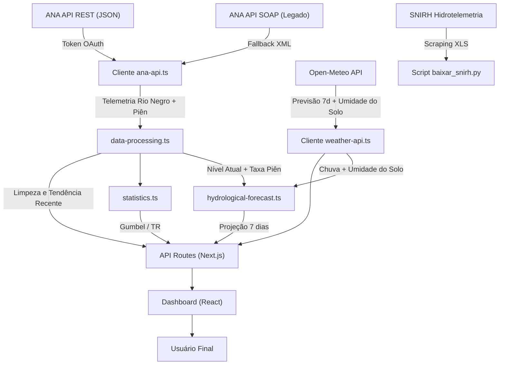

# Documentação Técnica — Hidro Alert: Nível Rio Negro

> **Sistema de Monitoramento Hidrológico e Alerta de Enchentes para Rio Negro (PR) e Mafra (SC)**

---

## 1. Visão Geral do Projeto

O **Hidro Alert** é uma aplicação web progressiva (PWA) desenvolvida em **Next.js 16 / React 19** para monitoramento em tempo real do nível do **Rio Negro** na região de Rio Negro (PR) e Mafra (SC), com base nos dados oficiais da **Agência Nacional de Águas e Saneamento Básico (ANA)**.

### 1.1 Objetivos

| Objetivo | Descrição |
|---|---|
| Monitoramento em tempo real | Leitura contínua da cota fluviométrica da Estação ANA 65100001 |
| Classificação de risco | Alertas visuais escalonados (Normal → Atenção → Alerta → Emergência) |
| Projeção hidrológica | Estimativa do comportamento do rio para os próximos 7 dias |
| Análise estatística de extremos | Distribuição de Gumbel e cálculo de Períodos de Retorno |
| Mapa de inundação | Manchas de inundação georreferenciadas por faixa de nível |
| Alertas preventivos | Notificações push para a população com base em limiares críticos |

### 1.2 Estações de Monitoramento da Bacia

O sistema integra múltiplas estações da bacia hidrográfica do Rio Negro para compor o diagnóstico em tempo real e as projeções futuras:

| Estação | Código ANA | Rio | Município / UF | Coordenadas | Função no Sistema |
|---|---|---|---|---|---|
| **Rio Negro (Principal)** | `65100001` | Rio Negro | Rio Negro – PR | -26.1114°S, -49.8044°W | Referência de nível e vazão urbana (Mafra/Rio Negro) |
| **Fragosos (Montante)** | `65090000` | Rio Negro | Piên – PR | -26.1547°S, -49.3806°W | Sensor de antecedência de cheias nas cabeceiras |
| **Fragosos (Pluviométrica)**| `02649018` | Rio Negro | Piên – PR | -26.1547°S, -49.3806°W | Medição de precipitação nas cabeceiras |
| **Rio Negro (Pluviométrica)**| `02649006` | Rio Negro | Rio Negro – PR | -26.1000°S, -49.8000°W | Medição local de precipitação pluviométrica |

> [!NOTE]
> A estação principal `65100001` é a referência oficial para a régua urbana de Mafra e Rio Negro. A estação fluviométrica `65090000` (Fragosos / Piên) monitora as cabeceiras da bacia a montante, antecipando ondas de cheia que levam de 24h a 48h para chegar à área urbana. Dados históricos de longo prazo (1930–2020) utilizam também os registros da estação convencional `65100000`.

---

## 2. Arquitetura e Fluxo de Dados



### 2.1 Pipeline de Dados

O sistema opera em **três camadas de aquisição de dados** com mecanismo de fallback automático:

1. **API REST da ANA** (prioritária): Autenticação via token OAuth, retorna JSON. Endpoint `HidroinfoanaSerieTelemetricaAdotada/v1`.
2. **API SOAP da ANA** (legado/fallback): Sem autenticação, retorna XML. Endpoints `ServiceANA.asmx`.
3. **SNIRH Hidrotelemetria** (complementar): Exportação via scraping web da série histórica em formato `.xls`.

> [!IMPORTANT]
> A API REST da ANA é limitada a 30 dias de dados por requisição. Para séries históricas longas (análise de Gumbel), o sistema automaticamente utiliza a API SOAP legada que suporta décadas de registros.

### 2.2 Normalização de Cotas

A cota (nível d'água) fornecida pela ANA pode vir em **centímetros** ou **metros** dependendo do endpoint e da época de registro. A função `normalizeLevelToMeters()` em [ana-api.ts](src/lib/ana-api.ts#L167-L183) padroniza todos os valores para **metros**:

- Valores > 30 são interpretados como centímetros e divididos por 100
- Valores sentinela (8888, 9999) são descartados como dados inválidos
- Valores > 15m (após conversão) são descartados como espúrios

---

## 3. Classificação de Risco

### 3.1 Limiares Operacionais

A classificação de risco segue os protocolos da **Defesa Civil** de Rio Negro (PR) e Mafra (SC), baseados nos marcos históricos de inundação locais:

| Nível do Rio | Classificação | Cor | Significado |
|---|---|---|---|
| < 5,00 m | 🟢 **Normal** | Verde | Nível dentro da faixa operacional. Sem risco. |
| ≥ 5,00 m | 🟡 **Atenção** | Amarelo | Nível elevado. Monitoramento ativo recomendado. |
| ≥ 6,00 m | 🟠 **Alerta** | Laranja | Risco de alagamento em áreas baixas e ribeirinhas. |
| ≥ 7,00 m | 🔴 **Emergência** | Vermelho | Enchente confirmada. Áreas ribeirinhas alagadas. |

Implementação em [statistics.ts](src/lib/statistics.ts#L47-L63) e [constants.ts](src/lib/constants.ts#L48-L53).

### 3.2 Marcos Críticos Georreferenciados (Régua de Inundação)

Os dados de [flood-map-data.ts](src/data/flood-map-data.ts) mapeiam pontos de infraestrutura e bairros com seus respectivos limiares de inundação:

| Ponto Crítico | Cidade | Cota de Inundação | Cota de Evacuação |
|---|---|---|---|
| Bairro Passa Três | Rio Negro (PR) | 6,50 m | 7,00 m |
| Rua São João / Volta Grande | Rio Negro (PR) | 6,80 m | 7,20 m |
| Vila Argentina | Mafra (SC) | 7,20 m | 7,50 m |
| Vila Ivete (Baixada) | Mafra (SC) | 7,60 m | 8,00 m |
| Bairro Buenos Aires | Mafra (SC) | 8,00 m | 8,50 m |
| Estação Nova | Rio Negro (PR) | 8,20 m | 8,80 m |
| Ponte Metálica | Intermunicipal | 8,50 m | — |
| Av. Frederico Heyse (Centro Mafra) | Mafra (SC) | 8,80 m | 9,20 m |
| Centro Histórico / Praça João Pessoa | Rio Negro (PR) | 10,20 m | 10,50 m |
| Ponte Cel. Severiano Maia | Intermunicipal | 10,50 m | — |
| Ponte Rodrigo Ajuz | Intermunicipal | 11,00 m | — |

### 3.3 Faixas da Mancha de Inundação (Polígonos Geoespaciais)

| Faixa | Nível | Severidade | Áreas Atingidas |
|---|---|---|---|
| Faixa 1 | 6,50 m – 7,50 m | Atenção | Várzeas, Passa Três, Rua São João, Baixada Vila Argentina |
| Faixa 2 | 7,50 m – 9,00 m | Alerta | Vila Argentina, Vila Ivete, acesso Ponte Metálica, Av. Frederico Heyse |
| Faixa 3 | 9,00 m – 11,00 m | Emergência | Centro de Mafra, Volta Grande, Buenos Aires, Estação Nova |
| Faixa 4 | > 11,00 m | Catastrófica | Praça João Pessoa, centros históricos, interdição total viária |

---

## 4. Análise Estatística de Extremos — Distribuição de Gumbel

### 4.1 Fundamentação Teórica

A análise de eventos extremos de cheia utiliza a **Distribuição de Gumbel (Tipo I para Máximos)**, também conhecida como *Generalized Extreme Value Type I (GEV-I)*. Essa distribuição é a mais amplamente utilizada na hidrologia brasileira para modelar máximas anuais de vazão e cota fluviométrica.

A função de distribuição acumulada (CDF) é:

$$F(x) = \exp\left(-\exp\left(-\frac{x - \mu}{\beta}\right)\right)$$

Onde:
- $\mu$ = **parâmetro de localização** (moda da distribuição)
- $\beta$ = **parâmetro de escala** (dispersão)
- $x$ = nível da água (variável de interesse)

### 4.2 Estimação dos Parâmetros — Método dos Momentos

O projeto utiliza o **Método dos Momentos** para estimar os parâmetros de Gumbel, conforme descrito em Naghettini & Pinto (2007) e Tucci (2009):

1. **Média amostral**:

$$\bar{x} = \frac{1}{n} \sum_{i=1}^{n} x_i$$

2. **Desvio padrão amostral** (estimador não-tendencioso com divisor $n-1$):

$$s = \sqrt{\frac{1}{n-1} \sum_{i=1}^{n} (x_i - \bar{x})^2}$$

3. **Parâmetro de escala**:

$$\beta = \frac{s \cdot \sqrt{6}}{\pi}$$

4. **Parâmetro de localização**:

$$\mu = \bar{x} - \gamma \cdot \beta$$

Onde $\gamma = 0{,}5772156649\ldots$ é a **constante de Euler-Mascheroni**.

Implementação em [statistics.ts](src/lib/statistics.ts#L98-L137) — função `calculateGumbel()`.

### 4.3 Probabilidade de Excedência

A **probabilidade anual de excedência** (probabilidade de que o nível $x$ seja igualado ou superado em qualquer ano) é:

$$P(X > x) = 1 - F(x) = 1 - \exp\left(-\exp\left(-\frac{x - \mu}{\beta}\right)\right)$$

Implementação em [statistics.ts](src/lib/statistics.ts#L162-L168) — função `calculateExceedanceProbability()`.

### 4.4 Período de Retorno (Tempo de Recorrência)

O **Período de Retorno** $T_R$ é o inverso da probabilidade de excedência:

$$T_R = \frac{1}{P(X > x)} = \frac{1}{1 - F(x)}$$

**Interpretação**: Se $T_R = 50$ anos para um nível de 10,00 m, significa que, *em média*, esse nível é igualado ou superado **uma vez a cada 50 anos** (ou seja, em qualquer ano há 2% de probabilidade de ocorrência).

Implementação em [statistics.ts](src/lib/statistics.ts#L178-L187) — função `returnPeriod()`.

### 4.5 Função Quantil (Inversa de Gumbel)

Para calcular **qual nível corresponde a um dado Período de Retorno**, utiliza-se a função quantil inversa:

$$x = \mu + \beta \cdot y_T$$

Onde a **variável reduzida de Gumbel** $y_T$ é:

$$y_T = -\ln\left(-\ln\left(1 - \frac{1}{T_R}\right)\right)$$

Implementação em [statistics.ts](src/lib/statistics.ts#L199-L216) — função `gumbelQuantile()`.

### 4.6 Tabela de Períodos de Retorno Padrão

O sistema gera automaticamente a tabela para os períodos padrão da hidrologia brasileira:

| $T_R$ (anos) | Probabilidade Anual | Uso Típico |
|---|---|---|
| 2 | 50,00% | Capacidade do leito menor |
| 5 | 20,00% | Drenagem urbana pluvial |
| 10 | 10,00% | Pontes e bueiros |
| 25 | 4,00% | Obras hidráulicas de médio porte |
| 50 | 2,00% | Barragens e proteção de áreas urbanas |
| 100 | 1,00% | Projetos de alta responsabilidade |

Implementação em [statistics.ts](src/lib/statistics.ts#L225-L241) — função `generateReturnPeriodTable()`.

### 4.7 Série Histórica Consolidada e Base Local Permanente

Para garantir **100% de disponibilidade, robustez e velocidade instantânea (0 ms)** na análise estatística de Gumbel, o sistema armazena a série histórica completa de 96 anos (1930 a 2025) localmente no arquivo [historical-annual-maxima.ts](src/data/historical-annual-maxima.ts).

- **Base de Dados**: Contém as 96 máximas anuais (1930 a 2025) e o catálogo com todos os 78 eventos históricos de inundação registrados em RioMafra (incluindo 1983 com 14,57 m, 1992 com 14,39 m, 2014 com 13,68 m e 2023 com 14,00 m).
- **Filtro da Tendência Recente (1990–2025)**: Para os cálculos de probabilidade e Período de Retorno (Gumbel), o sistema filtra automaticamente os registros a partir de 1990 (36 anos de dados), capturando o aumento na frequência das cheias urbanas apontado por John (2021).
- **Integração Dinâmica do Ano Corrente (2026)**: A rota [statistics/route.ts](src/app/api/statistics/route.ts) consulta apenas a telemetria recente do ano em curso. Se a cota atingida em 2026 for relevante, ela é incorporada em tempo de execução à série histórica.

---

## 5. Motor de Projeção Hidrológica (Forecast Engine)

### 5.1 Modelo Conceitual

O módulo [hydrological-forecast.ts](src/lib/hydrological-forecast.ts) implementa um **modelo chuva-nível conceitual contínuo** calibrado especificamente para a bacia do Rio Negro com base nos achados de John (2021), integrando 7 módulos físicos e estatísticos:

1. **Convolução hidrológica com hidrograma unitário de 7 dias** (tempo de concentração estendido).
2. **Modulação por saturação / umidade do solo** (capacidade de infiltração vs. escoamento superficial).
3. **Efeito residual de precipitação recente** (chuva acumulada nas últimas 24h).
4. **Propagação hidrológica de montante** (*hydraulic routing* da onda de cheia de Piên/cabeceiras).
5. **Recessão natural atenuada** (drenagem gravitacional lenta em direção à cota base de $1{,}63\text{ m}$).
6. **Inércia da tendência recente** (persistência da taxa horária de subida/descida).
7. **Cálculo estocástico de probabilidade e bandas de incerteza** ($z\text{-score}$ para cotas de alerta e emergência).

### 5.2 Coeficiente de Resposta e Modulação por Umidade do Solo

O **coeficiente base de sensibilidade chuva-nível** é $C_r = 0{,}033\text{ m/mm}$, calibrado a partir da mediana do Quadro 9 da dissertação de John (2021). 

Para refletir a física de saturação do solo, a API Open-Meteo fornece a **umidade volumétrica do subsolo** ($\theta_{\text{solo}}$, medida na camada de 7 a 28 cm em $\text{m}^3/\text{m}^3$). A umidade modula o coeficiente de resposta via uma função quadrática limitada (*clamped*):

$$M_{\text{solo}} = \max\left(0{,}2;\; \min\left(2{,}0;\; \left(\frac{\theta_{\text{solo}}}{0{,}25}\right)^2\right)\right)$$

$$C_{r,\text{ajustado}} = C_r \times M_{\text{solo}}$$

Onde $\theta_{\text{ref}} = 0{,}25\text{ m}^3/\text{m}^3$ (25%) é a umidade média histórica da bacia:

| Estado do Solo | Umidade ($\theta_{\text{solo}}$) | Multiplicador ($M_{\text{solo}}$) | Resposta Efetiva ($C_{r,\text{ajustado}}$) | Efeito Dinâmico |
|---|---|---|---|---|
| 🟢 **Seco** | $< 0{,}20\text{ m}^3/\text{m}^3$ (<20%) | $0{,}20$ a $0{,}64$ | $0{,}007$ a $0{,}021\text{ m/mm}$ | Alta capacidade de infiltração; rio sobe pouco |
| 🟡 **Médio / Normal** | $\approx 0{,}25\text{ m}^3/\text{m}^3$ (25%) | $1{,}00$ | $0{,}033\text{ m/mm}$ | Resposta padrão calibrada |
| 🔴 **Saturado** | $> 0{,}35\text{ m}^3/\text{m}^3$ (>35%) | Até $2{,}00$ | $0{,}066\text{ m/mm}$ | Infiltração nula; precipitação vira enxurrada imediata |

### 5.3 Kernel de Propagação Hidrológica (Hidrograma Unitário de 7 Dias)

Conforme demonstrado por John (2021, pág. 106), as cheias na bacia do Rio Negro apresentam uma fase de ascensão longa (média de **7 a 15 dias**), resultante do relevo de baixa declividade e do extenso percurso fluvial.

O modelo distribui o impacto de cada chuva ao longo de 7 dias através do kernel de pesos $W$:

| Defasagem Temporal | Peso ($W_w$) | Fase Hidrológica |
|---|---|---|
| **Dia 0** (mesmo dia) | 5% | Escoamento superficial direto imediato |
| **Dia +1** (dia seguinte) | 15% | Chegada dos tributários próximos |
| **Dia +2** | 25% | **Pico do hidrograma** principal na régua de Mafra/Rio Negro |
| **Dia +3** | 25% | Sustentação do pico da bacia intermediária |
| **Dia +4** | 15% | Contribuição das cabeceiras mais distantes |
| **Dia +5** | 10% | Cauda do hidrograma (escoamento subsuperficial) |
| **Dia +6** | 5% | Fluxo de base tardio |

$$h_{\text{contribuição, chuva}}(t) = \sum_{w=0}^{6} P_{\text{efetiva}}(t-w) \times W_w \times C_{r,\text{ajustado}}$$

### 5.4 Efeito Residual de Chuvas Recentes (Últimas 24h)

Caso tenha ocorrido precipitação acumulada significativa nas últimas 24h ($P_{\text{24h}} > 5\text{ mm}$), o modelo adiciona sua contribuição residual ainda em trânsito:

$$\Delta h_{\text{residual}}(D_0) = P_{\text{24h}} \times 0{,}4 \times C_{r,\text{ajustado}}$$
$$\Delta h_{\text{residual}}(D_{+1}) = P_{\text{24h}} \times 0{,}2 \times C_{r,\text{ajustado}}$$

### 5.5 Propagação da Onda de Cheia a Montante (Estação Fragosos / Piên / Routing)

A telemetria da estação de cabeceira em **Fragosos / Piên** (`65090000`) fornece a taxa horária de variação $\dot{h}_{\text{montante}}$ (m/h). Quando $|\dot{h}_{\text{montante}}| > 0{,}01\text{ m/h}$ (variação $> 1\text{ cm/h}$), o modelo calcula a propagação da onda de montante (*hydraulic routing*) com tempo de viagem de 24h a 48h:

$$\Delta h_{\text{diário, montante}} = \dot{h}_{\text{montante}} \times 24 \quad [\text{m/dia}]$$

- **Dia +1 (Amanhã)**: recebe 40% da onda:
  $$h_{\text{montante}}(D_{+1}) = \Delta h_{\text{diário, montante}} \times 0{,}40$$
- **Dia +2 (Depois de amanhã)**: recebe 30% da onda:
  $$h_{\text{montante}}(D_{+2}) = \Delta h_{\text{diário, montante}} \times 0{,}30$$

### 5.6 Chuva Efetiva Ponderada por Certeza

A precipitação diária bruta prevista ($P_{\text{bruta}}$) é ajustada pela probabilidade meteorológica de ocorrência ($p_{\text{prob}} \in [0, 1]$):

$$P_{\text{efetiva}} = P_{\text{bruta}} \times (0{,}4 + 0{,}6 \times p_{\text{prob}})$$

### 5.7 Recessão Natural do Nível

A drenagem da bacia é lenta (levando de 21 a 52 dias para retornar aos níveis basais, cerca de 4,4x mais lenta que a subida). A curva de recessão diária opera sobre o excesso acima do nível médio de estiagem ($h_{\text{base}} = 1{,}63\text{ m}$):

$$\text{Excesso} = \max(0;\; h_{i-1} - 1{,}63)$$

$$R_{\text{diária}} = \min\left(0{,}50;\; \text{Excesso} \times 0{,}035 + 0{,}02\right)$$

### 5.8 Inércia da Tendência Recente

No primeiro dia de projeção ($D+1$), a taxa horária recente de variação local ($\dot{h}_{\text{recente}}$ em m/h) é incorporada como fator de inércia, limitada entre $-0{,}15\text{ m}$ e $+0{,}25\text{ m}$:

$$I = \max(-0{,}15;\; \min(0{,}25;\; \dot{h}_{\text{recente}} \times 12))$$

### 5.9 Equação de Atualização do Nível

Para cada dia projetado $i \in [1, n-1]$ (onde o Dia 0 é o nível medido atual):

$$h_i = \max\left(1{,}63;\; h_{i-1} - R_i + h_{\text{contribuição}}(i) + I_i\right)$$

Onde $I_i$ só atua em $i = 1$ e $h_{\text{contribuição}}(i)$ soma a chuva local prevista, a chuva residual de 24h e o trânsito da onda de montante de Piên.

### 5.10 Margens de Incerteza

A incerteza estatística cresce com o horizonte temporal e com a magnitude da precipitação:

$$\sigma_i = 0{,}12 + (i - 1) \times 0{,}07 + \begin{cases} 0{,}30 & \text{se } P_i > 15\text{ mm} \\ 0{,}08 & \text{caso contrário} \end{cases}$$

- **Cenário otimista** (mínimo): $h_{\text{min}} = \max(1{,}63;\; h_{\text{esperado}} - \sigma_i)$
- **Cenário pessimista** (máximo): $h_{\text{max}} = h_{\text{esperado}} + 1{,}35 \times \sigma_i$

### 5.11 Cálculo de Probabilidade de Enchente

A probabilidade diária de superar os limiares críticos (Alerta: 6,00 m; Emergência: 7,00 m) é calculada via $z\text{-score}$:

$$z = \frac{h_{\text{crítico}} - h_{\text{esperado}}}{1{,}1 \times \sigma_i}$$

| $z$-score | Probabilidade de Superação | Interpretação |
|---|---|---|
| $\le -1{,}5$ | 98% | Evento iminente / Praticamente certo |
| $\le -1{,}0$ | 92% | Altíssima probabilidade |
| $\le -0{,}5$ | 80% | Alta probabilidade |
| $\le 0{,}0$ | 55% | Cota esperada atinge ou supera o limiar |
| $\le 0{,}5$ | 35% | Risco moderado |
| $\le 1{,}0$ | 18% | Risco baixo |
| $\le 1{,}5$ | 8% | Risco muito baixo |
| $\le 2{,}0$ | 3% | Improvável |
| $> 2{,}0$ | 1% | Risco residual |

### 5.12 Painel de Fatores Agravantes do Dashboard

O componente [aggravating-factors-card.tsx](src/components/dashboard/aggravating-factors-card.tsx) resume esses sensores físicos para o público geral:

| Sensor Físico | Variável | Faixas e Limiares | Mensagem no Painel |
|---|---|---|---|
| **Chuva Prevista (7d)** | $P_{\text{7d}}$ (mm) | $> 100\text{ mm}$ (Alto) / $> 40\text{ mm}$ (Médio) / Baixo | Volume acumulado previsto na bacia |
| **Saturação do Solo** | $\theta_{\text{solo}}$ ($\text{m}^3/\text{m}^3$) | $> 35\%$ (Crítico) / $> 25\%$ (Atenção) / Seguro | Capacidade de absorção do solo vs. enxurrada |
| **Onda de Cheia (Montante)** | $\dot{h}_{\text{montante}}$ (m/h) | $> 5\text{ cm/h}$ (Risco Alto) / $> 1\text{ cm/h}$ (Atenção) / Estável | Velocidade de subida do rio em Piên (cabeceiras) |

Implementação completa em [hydrological-forecast.ts](src/lib/hydrological-forecast.ts#L60-L256).

---

## 6. Processamento de Dados Hidrológicos

### 6.1 Limpeza e Validação

A função `cleanRiverData()` em [data-processing.ts](src/lib/data-processing.ts#L58-L98) realiza:

1. Remoção de registros nulos, indefinidos ou com data inválida
2. Limitação de valores negativos a zero
3. Deduplicação por chave temporal (data/hora)
4. Ordenação cronológica crescente

### 6.2 Cálculo de Tendência

A função `calculateTrend()` em [data-processing.ts](src/lib/data-processing.ts#L107-L184) calcula a **taxa de variação do nível** em uma janela temporal:

$$\dot{h} = \frac{h_{atual} - h_{anterior}}{\Delta t_{horas}} \quad [\text{m/h}]$$

Classificação:

| Taxa (m/h) | Direção |
|---|---|
| > +0,02 | 📈 Subindo (*rising*) |
| -0,02 a +0,02 | ➡️ Estável (*stable*) |
| < -0,02 | 📉 Descendo (*falling*) |

### 6.3 Agregação Diária

A função `aggregateByDay()` em [data-processing.ts](src/lib/data-processing.ts#L218-L294) agrupa leituras horárias/telemétricas em resumos diários:

- **Nível médio diário**: $\bar{h}_{dia} = \frac{1}{n}\sum h_i$
- **Nível máximo do dia**: $h_{max} = \max(h_i)$
- **Nível mínimo do dia**: $h_{min} = \min(h_i)$
- **Vazão média diária**: $\bar{Q}_{dia} = \frac{1}{n}\sum Q_i$
- **Precipitação acumulada**: $P_{total} = \sum P_i$

### 6.4 Curva-Chave Simplificada (Nível → Vazão)

Nos dados simulados de contingência, a relação nível-vazão segue uma **potência** calibrada para o Rio Negro:

$$Q = 8{,}8 \times h^{2,4} + \epsilon$$

Onde $\epsilon$ é um ruído oscilatório de baixa amplitude. Essa formulação é consistente com curvas-chave típicas de rios de planície.

### 6.5 Estatísticas Descritivas

A função `calculateSummaryStatistics()` em [statistics.ts](src/lib/statistics.ts#L246-L282) calcula:

- Contagem de observações válidas ($n$)
- Média aritmética ($\bar{x}$)
- Desvio padrão amostral ($s$, com divisor $n-1$)
- Mínimo e Máximo
- Mediana (percentil 50)

---

## 7. Previsão Meteorológica

### 7.1 Fonte de Dados

A previsão do tempo e os dados ambientais de solo são obtidos da **API Open-Meteo**, um serviço aberto que fornece previsões numéricas do tempo (NWP) baseadas em modelos globais e regionais (como ECMWF, GFS e ICON):

- **URL Base**: `https://api.open-meteo.com/v1/forecast`
- **Coordenadas**: -26.1114°S, -49.8044°W (centro da bacia do Rio Negro)
- **Horizonte**: 7 dias
- **Variáveis diárias**: código WMO, temperatura máx/mín, precipitação acumulada (`precipitation_sum`), probabilidade de precipitação (`precipitation_probability_max`), velocidade máxima do vento
- **Variáveis horárias**: precipitação horária, probabilidade horária de chuva, temperatura a 2m, **umidade volumétrica do solo na camada 7 a 28 cm** (`soil_moisture_7_to_28cm`)
- **Timezone**: America/Sao_Paulo

Implementação em [weather-api.ts](src/lib/weather-api.ts#L188-L289).

### 7.2 Códigos Meteorológicos WMO

Os códigos de tempo seguem a padronização da **World Meteorological Organization (WMO)**, traduzidos para português em [weather-api.ts](src/lib/weather-api.ts#L48-L100).

### 7.3 Mecanismo de Fallback

Caso a API Open-Meteo esteja temporariamente indisponível, o sistema gera uma **previsão calibrada de fallback** baseada no padrão climatológico típico do **Planalto Norte Catarinense**, com chuvas alternadas e temperaturas entre 10°C e 24°C.

---

## 8. APIs e Fontes de Dados da ANA

### 8.1 Nova API REST (JSON)

| Endpoint | Função |
|---|---|
| `HidroInventarioEstacoes/v1` | Inventário de estações |
| `HidroinfoanaSerieTelemetricaAdotada/v1` | Dados telemétricos adotados (últimos 30 dias) |
| `HidroinfoanaSerieTelemetricaDetalhada/v1` | Dados telemétricos detalhados |
| `OAUth/v1` | Autenticação (token de 60 min) |

Autenticação via headers `Identificador` e `Senha`. Token renovado a cada 45 minutos.

### 8.2 API SOAP Legada

| Endpoint | Função |
|---|---|
| `ServiceANA.asmx/HidroInventario` | Inventário de estações |
| `ServiceANA.asmx/HidroSerieHistorica` | Série histórica (décadas de dados) |
| `ServiceANA.asmx/DadosHidrometeorologicos` | Telemetria em tempo real |
| `ServiceANA.asmx/ListaEstacoesTelemetricas` | Lista de estações telemétricas |

Formato de resposta: XML. Parsing por regex de tags.

### 8.3 SNIRH Hidrotelemetria (Scraping)

O script [baixar_snirh.py](scripts/baixar_snirh.py) faz download automatizado da série histórica da estação via interface web do SNIRH, exportando para formato `.xls` (Excel).

---

## 9. Estrutura de Arquivos do Projeto

```
hidro-simulator/
├── src/
│   ├── app/
│   │   ├── api/
│   │   │   ├── river-data/route.ts          ← Dados telemétricos em tempo real
│   │   │   ├── precipitation/route.ts        ← Dados de precipitação acumulada
│   │   │   ├── statistics/route.ts           ← Análise de Gumbel e TR
│   │   │   ├── weather-forecast/route.ts     ← Previsão do tempo + Projeção hidrológica
│   │   │   ├── cron/check-alerts/route.ts    ← Verificação periódica e disparo de alertas
│   │   │   └── notifications/
│   │   │       ├── subscribe/route.ts        ← Inscrição de notificações Web Push
│   │   │       └── test/route.ts             ← Teste de envio de push
│   │   ├── page.tsx                          ← Dashboard principal e controle de abas
│   │   ├── layout.tsx                        ← Layout raiz + metadados SEO + PWA
│   │   └── globals.css                       ← Estilos globais e Tailwind v4
│   ├── lib/
│   │   ├── ana-api.ts                        ← Cliente ANA (REST JSON + SOAP legada)
│   │   ├── weather-api.ts                   ← Cliente Open-Meteo (NWP + umidade do solo)
│   │   ├── data-processing.ts               ← Limpeza, deduplicação, agregação e tendência
│   │   ├── statistics.ts                    ← Gumbel, Período de Retorno e estatísticas
│   │   ├── hydrological-forecast.ts         ← Motor de projeção hidrológica contínua (7d)
│   │   ├── constants.ts                     ← Estações, limiares de risco e endpoints
│   │   ├── push-service.ts                  ← Envio de notificações VAPID/Web Push
│   │   ├── push-storage.ts                  ← Persistência de assinaturas de moradores
│   │   └── utils.ts                         ← Utilitários auxiliares e formatação
│   ├── components/dashboard/                ← 22 componentes React modulares do dashboard
│   │   ├── hero-section.tsx                 ← Nível atual, status e data da última leitura
│   │   ├── dynamic-alert-banner.tsx         ← Faixa de alerta responsiva e dinâmica
│   │   ├── stats-cards.tsx                  ← Cards rápidos de métricas (taxa, chuva, pico)
│   │   ├── aggravating-factors-card.tsx     ← Sensores físicos (Chuva, Solo e Piên)
│   │   ├── friendly-summary.tsx             ← Resumo em linguagem natural para o cidadão
│   │   ├── river-level-chart.tsx            ← Gráfico interativo com histórico de cotas
│   │   ├── precipitation-chart.tsx          ← Gráfico de barras de precipitação
│   │   ├── forecast-trend-chart.tsx         ← Projeção com bandas de incerteza e histórico
│   │   ├── forecast-daily-cards.tsx         ← Previsão do tempo diária e risco por dia
│   │   ├── flood-map.tsx / flood-map-client ← Mapa Leaflet com manchas e pontos críticos
│   │   ├── flood-ruler.tsx                  ← Régua física vertical com cotas de referência
│   │   ├── return-period.tsx                ← Tabela e análise estatística de Gumbel
│   │   ├── interactive-simulator.tsx        ← Simulador de cenários hipotéticos de chuva
│   │   ├── notification-dialog.tsx          ← Modal de inscrição de push notifications
│   │   └── ... (outros componentes de apoio)
│   └── data/
│       ├── flood-map-data.ts                ← Polígonos de inundação e marcos críticos
│       └── historical-annual-maxima.ts      ← Série histórica consolidada de 1930 a 2025 (96 anos)
├── worker/
│   └── index.ts                             ← Service Worker customizado (PWA + cache)
├── docs/
│   ├── METODOLOGIA.md                       ← Resumo da fundamentação metodológica
│   └── dados_rio_negro_18_fev_a_18_ago_2026.xls ← Planilha com dados históricos SNIRH
└── scripts/
    └── baixar_snirh.py                      ← Script auxiliar para download da telemetria SNIRH
```

---

## 10. Referências Bibliográficas e Técnicas

### Fonte Principal (Base de Dados e Metodologia)

1. **JOHN, Micheli Maclin Liebel.** *Inundações urbanas no aglomerado Rio Negro - Mafra: contribuições à compreensão da dinâmica hidrológica e dos impactos na gestão urbana*. 2021. 142 f. Dissertação (Mestrado em Engenharia Civil) – Universidade Tecnológica Federal do Paraná (UTFPR), Curitiba, 2021.
   - O presente projeto utilizou como base primária o levantamento histórico (1930 a 2020), as análises estatísticas da aplicação do Método de Gumbel para obtenção do Tempo de Retorno (TR), a organização da topologia dos marcos críticos georreferenciados e as tabelas e recortes de inundação propostas por esta pesquisa.

### Hidrologia e Estatística de Extremos

1. **NAGHETTINI, M.; PINTO, E. J. A.** *Hidrologia Estatística*. Belo Horizonte: CPRM (Serviço Geológico do Brasil), 2007. 552 p. ISBN 978-85-7499-023-1.
   - Referência principal para Distribuição de Gumbel, Método dos Momentos e Períodos de Retorno.

2. **TUCCI, C. E. M.** *Hidrologia: Ciência e Aplicação*. 4ª ed. Porto Alegre: Editora da UFRGS/ABRH, 2009. 943 p. ISBN 978-85-7025-924-5.
   - Referência para hidrogramas unitários, tempos de concentração e modelagem chuva-vazão.

3. **CHOW, V. T.; MAIDMENT, D. R.; MAYS, L. W.** *Applied Hydrology*. New York: McGraw-Hill, 1988. ISBN 0-07-010810-2.
   - Referência internacional para análise de frequência de cheias e distribuições de valores extremos.

4. **GUMBEL, E. J.** *Statistics of Extremes*. New York: Columbia University Press, 1958. (Reimpresso por Dover Publications, 2004). ISBN 978-0-486-43604-7.
   - Obra original do autor da distribuição, fundamentando a teoria de valores extremos.

5. **KITE, G. W.** *Frequency and Risk Analyses in Hydrology*. Fort Collins: Water Resources Publications, 1977. 224 p. ISBN 978-0-918334-64-0.
   - Análise de frequência e risco em hidrologia com aplicações práticas.

### Normas Técnicas Brasileiras

6. **ABNT NBR 10844:1989** — *Instalações prediais de águas pluviais*. Associação Brasileira de Normas Técnicas.
   - Períodos de retorno para projetos de drenagem urbana.

7. **ANA — Agência Nacional de Águas e Saneamento Básico.** *Orientações para consistência de dados fluviométricos*. Brasília: ANA/SGH, 2012.
   - Procedimentos de consistência e validação de dados hidrológicos.

8. **ANA — Agência Nacional de Águas e Saneamento Básico.** *Manual de procedimentos técnicos em hidrometria*. Brasília: ANA, 2014.
   - Procedimentos de medição de nível d'água e vazão em estações fluviométricas.

### Fontes de Dados

9. **SNIRH — Sistema Nacional de Informações sobre Recursos Hídricos.** Disponível em: <https://www.snirh.gov.br/hidrotelemetria/>. Acesso contínuo.
   - Portal oficial da ANA para dados de telemetria hídrica em tempo real.

10. **ANA — Hidrowebservice.** API REST e SOAP para dados hidrométricos. Disponível em: <https://www.ana.gov.br/hidrowebservice/>.
    - Webservice oficial da ANA para acesso programático a dados de estações.

11. **Open-Meteo.** *Free Weather API*. Disponível em: <https://open-meteo.com/>. Acesso contínuo.
    - API aberta para previsão numérica do tempo (NWP) baseada em modelos como GFS, ECMWF, ICON.

12. **WMO — World Meteorological Organization.** *Manual on Codes — International Codes, Volume I.1*. WMO-No. 306. Geneva: WMO, 2019.
    - Padronização dos códigos de tempo (weather codes) utilizados na API Open-Meteo.

### Defesa Civil e Gestão de Riscos

13. **BRASIL. Ministério da Integração e do Desenvolvimento Regional.** *Sistema Nacional de Proteção e Defesa Civil — SINPDEC*. Lei nº 12.608/2012.
    - Marco legal para classificação de riscos e alertas de desastres naturais.

14. **CENAD — Centro Nacional de Gerenciamento de Riscos e Desastres.** *Protocolo de Ações para Eventos Hidrológicos Críticos*. Brasília: MI/SEDEC, 2016.
    - Protocolos de alerta para eventos hidrológicos, incluindo limiares de risco.

### Tecnologias Utilizadas

15. **Next.js 16** — Framework React com SSR/ISR. <https://nextjs.org/>
16. **React 19** — Biblioteca de interfaces. <https://react.dev/>
17. **Recharts 3** — Biblioteca de gráficos. <https://recharts.org/>
18. **Leaflet 1.9** — Biblioteca de mapas interativos. <https://leafletjs.com/>
19. **Web Push API** — Notificações push para PWA. <https://developer.mozilla.org/en-US/docs/Web/API/Push_API>
20. **Tailwind CSS 4** — Framework de estilização utility-first. <https://tailwindcss.com/>

---

## 11. Glossário de Termos Hidrológicos

| Termo | Definição |
|---|---|
| **Cota** | Nível da água medido em metros na régua da estação fluviométrica |
| **Vazão** | Volume de água que passa por uma seção transversal do rio por unidade de tempo (m³/s) |
| **Curva-chave** | Relação empírica entre cota e vazão, específica para cada seção de medição |
| **Período de Retorno ($T_R$)** | Intervalo médio de recorrência (em anos) de um evento igual ou mais extremo |
| **Hidrograma unitário** | Resposta hidrológica da bacia a uma unidade de precipitação efetiva |
| **Tempo de concentração** | Tempo necessário para a água do ponto mais distante da bacia atingir a seção de medição |
| **Recessão** | Fase descendente do hidrograma, quando o escoamento diminui após cessar a chuva |
| **Máxima anual** | Maior cota (ou vazão) registrada em cada ano hidrológico |
| **Distribuição de Gumbel** | Distribuição de probabilidade para modelagem de extremos (máximas ou mínimas) |
| **Constante de Euler-Mascheroni (γ)** | Constante matemática ≈ 0,5772, utilizada na relação entre média e moda da Distribuição de Gumbel |

---

> [!TIP]
> Esta documentação reflete o estado do código-fonte em **agosto de 2026**. Para a versão mais atualizada de cada cálculo, consulte os arquivos-fonte referenciados via links ao longo do documento.
